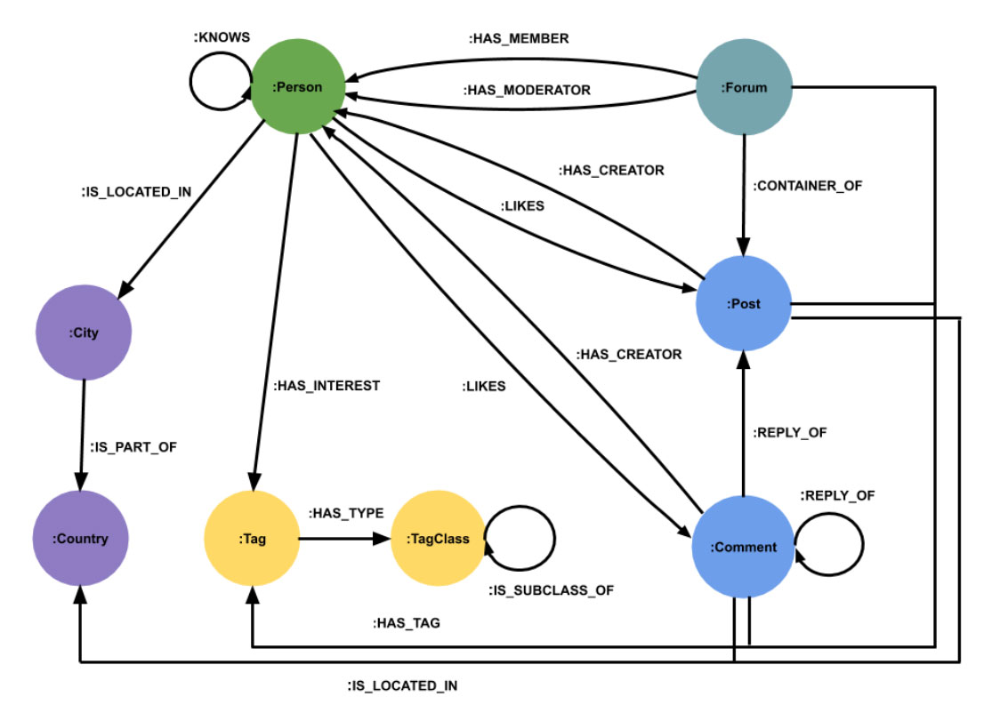
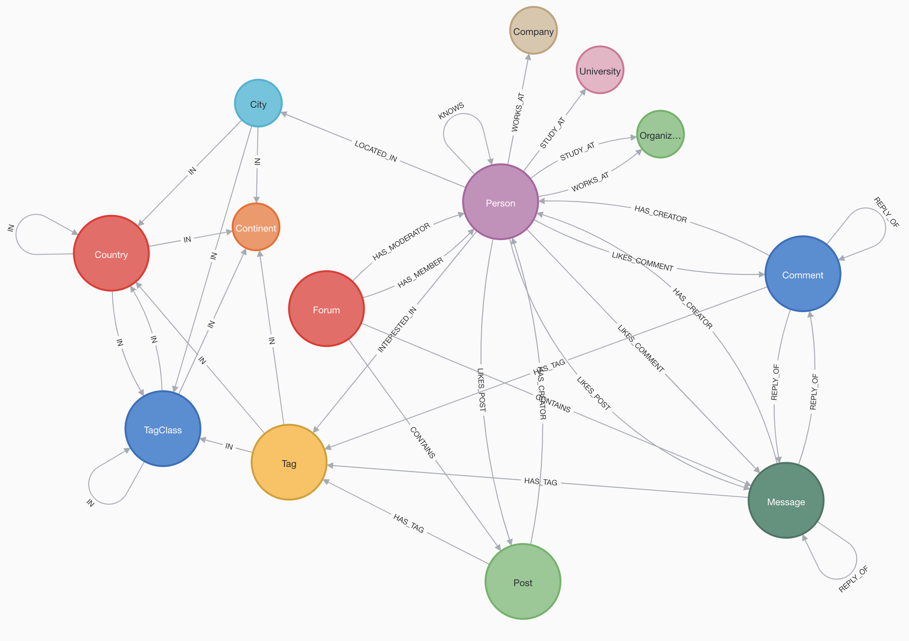

# LDBC SF-1 Bulk Ingestion Scripts

## Overview

These steps should be used for the bulk ingestion of LDBC-SF* data files.  They have been tested using the SF-1 set of files, but theoretically, the SF-10 and SF-100 files should be different only in the number of nodes and edges.

The basis of this work is the LDBC GitHub repo at https://github.com/ldbc/ldbc_snb_interactive_impls  

The individual queries can be found at:
https://github.com/ldbc/ldbc_snb_interactive_impls/tree/main/cypher/queries

The LDBC scripts and data files on this repo were used as a starting point, but after careful analysis of the data model, it was decided to make minor tweaks to the data model to remove some obvious supernodes and to make it significantly more performant.  Unlike RDBMS rule-based data modeling processes that were codified decades ago, Neo4j's process is very flexible and architects can choose from multiple approaches in order to achieve optimal performance for the particular use case.

For example, simply eliminating the superfluous relationships (:Post)-[:IS_LOCATED_IN]->(:Country) and (:Comment)-[:IS_LOCATED_IN]->(:Country) will eliminate the need for potentially billions of unnecessary relationships - most of which would have been attached to only a handful of supernodes.  Storing a well-known Country abreviation e.g. 'UK', 'USA', 'DK' as a property on the :Post node instead of using a relationship to the :Country record is arguably a violation of the RDBMS Normalization rules, but is an expedient choice in Neo4j Graph modeling.

## Original Data model



## Revised Data model




# Input Data File Preparation

The input files used were from the LDBC SNB SF-1 collection.  The files were unzipped into a holding directory before being prepared.
The files contain headers which are useful for using the simple LOAD CSV command, but will interfere with Neo4j-Admin import unless the utility is directed to skip the headers in the file chunks.

``` Text
--auto-skip-subsequent-headers[=<true/false>]]

```

## Neo4j Bulk Import Utility

The Neo4j bulk importer is a utility that generates a new, off-line database using specifically formattted csv files.  The data directory for the new database must be empty or the utility will throw an error message.  This means that the utility is best used for initial loads or for PoC purposes - not for incremental loading of a production database.

Please review the documentation for the bulk loading tool before attempting to run.

https://neo4j.com/docs/operations-manual/current/tutorial/neo4j-admin-import/


### Processing

The utility will first import nodes and then relationships. Specialized header files are used to specify which fields are to be imported along with their data types.  Labels can be assigned to all rows within a given CSV file and/or each row in the CSV files can specify which labels are to be assigned to that particular row.   The LDBC data files use each of these methods for assigning labels.

 ### Use of Regex.
 The admin import tool is somewhat flexible for specifying which CSV files are to be included for each --nodes or --relationships directive.  Single files may be used, Header files may be used, and Regex may be used to specify all files that meet a particular pattern.  

 Regex is fairly handy even for small imports such as the SF1 files, but is absolutely necessary for larger collections.  In the SF1 collection, there are 17 CSV Files for :Comment nodes that need to be loaded and the regex pattern $NEO4J_IMPORT_ROOT/nodes/comment.*  will automatically pull in all 17 of the file chunks. In the SF10 and SF100 collections, there can be hundreds of files for a given --nodes or --relationships directive.  

 In the snippet below, the Organization nodes will be loaded using a header file and a single CSV file.   The header file contains a column called :LABEL that specifies the contents of that column will determine which labels should be used for that row.

``` Text

--nodes=Organization=$NEO4J_IMPORT_ROOT/headers/Organization_header.csv,$NEO4J_IMPORT_ROOT/nodes/organization.csv  \

```
Organization_header.csv
``` text
id:ID(Organization)|:LABEL|name:STRING|url:STRING

```

For nodes and relationships with multiple files, the syntax is similar, but uses regex to specify the matching pattern.  The snippet below shows how the :Comment nodes are defined.

Unlike the Organization nodes   The Comment header file does not contain a column called :LABEL so the --nodes directive declares that all nodes in the file will be given a :Comment label and a :Message label.

All files that match the regex pattern will be used.   

The import utility will report back which files were used for each label directive.  This list should be carefully examined to ensure that the regex patterns were correct and that all files were processed correctly.

It is highly recommended that each of the nodes & relationships be given their own directories for containing the file chunks.   The SF1 download creates separate directories but they were not used in this script.

``` Text
nodes=Comment:Message=$NEO4J_IMPORT_ROOT/headers/Comment_header.csv,$NEO4J_IMPORT_ROOT/nodes/comment.*  \

```
Comment_header.csv
``` text
creationDate:DATETIME|id:ID(Comment)|locationIP:STRING|browserUsed:STRING|content:STRING|length:LONG

```

## Loading Syntax


This is subject to change.  Please use the syntax in the scripts directory for the latest.

```Text

export NEO4J_ROOT=/Users/markquinsland/Library/Application\ Support/Neo4j\ Desktop/Application/relate-data/dbmss/dbms-07b4a66d-2800-426b-afb7-cc73a00f791d
echo $NEO4J_ROOT

#export NEO4J_IMPORT_ROOT=/Users/markquinsland/Library/Application\ Support/Neo4j\ Desktop/Application/relate-data/dbmss/dbms-07b4a66d-2800-426b-afb7-cc73a00f791d/import
export NEO4J_IMPORT_ROOT=/Users/markquinsland/Documents/GitHub/sbox_ldbc/import
echo $NEO4J_IMPORT_ROOT
#!/bin/bash
echo "==============================================================================="
echo "Loading the Neo4j database"
echo "-------------------------------------------------------------------------------"
echo "NEO4J_VERSION: ${NEO4J_VERSION}"

echo "==============================================================================="

export JAVA_OPTS='-server -Xms1g -Xmx1g'
echo "JAVA_OPTS: ${JAVA_OPTS}"

# uses default database neo4j - change as appropriate

# Note - most of these use regex to allow multiple files for nodes/edges

../bin/neo4j-admin import \
    --database=neo4j \
    --id-type=INTEGER \
    --ignore-empty-strings=true \
    --bad-tolerance=0 \
    --auto-skip-subsequent-headers=true \
    --skip-duplicate-nodes \
    --delimiter '|' \
    --nodes $NEO4J_IMPORT_ROOT/headers/Place_header.csv,$NEO4J_IMPORT_ROOT/nodes/Place/place.*  \
    --nodes=Person=$NEO4J_IMPORT_ROOT/headers/Person_header.csv,$NEO4J_IMPORT_ROOT/nodes/Person/person.*  \
    --nodes=Comment:Message=$NEO4J_IMPORT_ROOT/headers/Comment_header.csv,$NEO4J_IMPORT_ROOT/nodes/Comment/comment.*  \
    --nodes=Organization=$NEO4J_IMPORT_ROOT/headers/Organization_header.csv,$NEO4J_IMPORT_ROOT/nodes/Organization/organization.*  \
    --nodes=Tag=$NEO4J_IMPORT_ROOT/headers/Tag_header.csv,$NEO4J_IMPORT_ROOT/nodes/Tag/tag.*  \
    --nodes=TagClass=$NEO4J_IMPORT_ROOT/headers/TagClass_header.csv,$NEO4J_IMPORT_ROOT/nodes/TagClass/tagClass.*  \
    --nodes=Forum=$NEO4J_IMPORT_ROOT/headers/Forum_header.csv,$NEO4J_IMPORT_ROOT/nodes/Forum/forum.* \
    --nodes=Post:Message=$NEO4J_IMPORT_ROOT/headers/Post_header.csv,$NEO4J_IMPORT_ROOT/nodes/Post/post.* \
    --relationships=IS_LOCATED_IN=$NEO4J_IMPORT_ROOT/headers/Post_LOCATED_IN_header.csv,$NEO4J_IMPORT_ROOT/relationships/Post_LOCATED_IN/Post_LOCATED_IN.* \
    --relationships=IS_LOCATED_IN=$NEO4J_IMPORT_ROOT/headers/Comment_LOCATED_IN_header.csv,$NEO4J_IMPORT_ROOT/relationships/Comment_LOCATED_IN/Comment_LOCATED_IN.* \
    --relationships=IN=$NEO4J_IMPORT_ROOT/headers/Place_IN_header.csv,$NEO4J_IMPORT_ROOT/relationships/Place_IN/Place_IN.* \
    --relationships=LOCATED_IN=$NEO4J_IMPORT_ROOT/headers/Person_LOCATED_IN_header.csv,$NEO4J_IMPORT_ROOT/relationships/Person_LOCATED_IN/Person_LOCATED_IN.* \
    --relationships=WORKS_AT=$NEO4J_IMPORT_ROOT/headers/Person_WORKS_AT_header.csv,$NEO4J_IMPORT_ROOT/relationships/Person_WORKS_AT/Person_WORKS_AT.* \
    --relationships=STUDY_AT=$NEO4J_IMPORT_ROOT/headers/Person_STUDY_AT_header.csv,$NEO4J_IMPORT_ROOT/relationships/Person_STUDY_AT/Person_STUDY_AT.csv \
    --relationships=INTERESTED_IN=$NEO4J_IMPORT_ROOT/headers/Person_INTERESTED_IN_header.csv,$NEO4J_IMPORT_ROOT/relationships/Person_INTERESTED_IN/Person_INTERESTED_IN.csv \
    --relationships=LIKES_POST=$NEO4J_IMPORT_ROOT/headers/Person_LIKES_POST_header.csv,$NEO4J_IMPORT_ROOT/relationships/Person_LIKES_POST/Person_LIKES_POST.* \
    --relationships=LIKES_COMMENT=$NEO4J_IMPORT_ROOT/headers/Person_LIKES_COMMENT_header.csv,$NEO4J_IMPORT_ROOT/relationships/Person_LIKES_COMMENT/Person_LIKES_COMMENT.* \
    --relationships=HAS_CREATOR=$NEO4J_IMPORT_ROOT/headers/Comment_HAS_CREATOR_header.csv,$NEO4J_IMPORT_ROOT/relationships/Comment_HAS_CREATOR/Comment_HAS_CREATOR.* \
    --relationships=REPLY_OF=$NEO4J_IMPORT_ROOT/headers/Comment_REPLY_OF_Comment_header.csv,$NEO4J_IMPORT_ROOT/relationships/Comment_REPLY_OF_Comment/Comment_REPLY_OF_Comment.* \
    --relationships=REPLY_OF=$NEO4J_IMPORT_ROOT/headers/Comment_REPLY_OF_Post_header.csv,$NEO4J_IMPORT_ROOT/relationships/Comment_REPLY_OF_Post/Comment_REPLY_OF_Post.* \
    --relationships=HAS_CREATOR=$NEO4J_IMPORT_ROOT/headers/Post_HAS_CREATOR_header.csv,$NEO4J_IMPORT_ROOT/relationships/Post_HAS_CREATOR/Post_HAS_CREATOR.* \
    --relationships=HAS_TAG=$NEO4J_IMPORT_ROOT/headers/Post_HAS_TAG_header.csv,$NEO4J_IMPORT_ROOT/relationships/Post_HAS_TAG/Post_HAS_TAG.* \
    --relationships=HAS_TAG=$NEO4J_IMPORT_ROOT/headers/Comment_HAS_TAG_header.csv,$NEO4J_IMPORT_ROOT/relationships/Comment_HAS_TAG/Comment_HAS_TAG.* \
    --relationships=KNOWS=$NEO4J_IMPORT_ROOT/headers/Person_KNOWS_header.csv,$NEO4J_IMPORT_ROOT/relationships/Person_KNOWS/Person_KNOWS.* \
    --relationships=HAS_MEMBER=$NEO4J_IMPORT_ROOT/headers/Forum_HAS_MEMBER_header.csv,$NEO4J_IMPORT_ROOT/relationships/Forum_HAS_MEMBER/Forum_HAS_MEMBER.* \
    --relationships=HAS_MODERATOR=$NEO4J_IMPORT_ROOT/headers/Forum_HAS_MODERATOR_header.csv,$NEO4J_IMPORT_ROOT/relationships/Forum_HAS_MODERATOR/Forum_HAS_MODERATOR.* \
    --relationships=CONTAINS=$NEO4J_IMPORT_ROOT/headers/Forum_CONTAINS_header.csv,$NEO4J_IMPORT_ROOT/relationships/Forum_CONTAINS/Forum_CONTAINS.*.csv \
    --relationships=IN=$NEO4J_IMPORT_ROOT/headers/Tag_IN_header.csv,$NEO4J_IMPORT_ROOT/relationships/Tag_IN/Tag_IN.*.csv \
    --relationships=IN=$NEO4J_IMPORT_ROOT/headers/TagClass_IN_header.csv,$NEO4J_IMPORT_ROOT/relationships/TagClass_IN/TagClass_IN.*.csv

```
## Output

The output from the neo4j-admin import job can be found [here](../output/results.txt).

# Mounting the Database (for non-default database names only)

Once the Neo4j-admin command has completed, the data directory contains a database that is ready to be mounted.   If the default database name neo4j was used, the system will mount it automatically.  If an alternate name was specified, the database must be mounted using the following code.

This is a simple Cypher command that can be run from either Cypher-shell, or from the Neo4j browser.

``` cypher

CREATE DATABASE name [IF NOT EXISTS]

```

It may take a few seconds - or longer for Neo to mount the DB because it's doing some consistency checks.  

You can check on the status by running the following Cypher command.

``` cypher

SHOW DATABASES

```


# Creating Indices

Once the database files have been created and mounted, the DB should be running and available for queries.  Unfortunately, virtually any query will perform poorly without first creating some indices.

Indices are created using Cypher commands and can be run using either Cypher Shell from the command line or from the Neo4j browser.

Here are the initial set of indices.  We will likely be adding some indices to support certain queries.

#### Running Cypher Shell from the command line.
``` BASH
cat indices.cypher | ../bin/cypher-shell -u username -p password --format plain

```

#### Indexing Cypher Statements
These can be run from the browser or put into a text file and run via Cypher Shell.

Generally speaking, any field used as a primary key or as a common lookup field should have an index.  Primary keys are usually defined as constraints and have supporting indexes created automatically.   All of the Labels in the LDBC model use a proprietary Id field as a primary key, so these will use constrains.  Other commonly used fields and relationships will have more traditional indices created.

Some relationship indices will be created to run common queries such as: what topics are trending based on the most recent 10k messages?
For more info on relationship indexes, please read the following.
https://neo4j.com/developer-blog/neo4j-4-3-blog-series-relationship-indexes/

``` cypher

// create primary key constraints (creates index automatically)

CREATE CONSTRAINT organization_constraint
IF NOT EXISTS
FOR (n:Organization) REQUIRE n.id IS UNIQUE;

CREATE CONSTRAINT place_constraint
IF NOT EXISTS
FOR (n:Place) REQUIRE n.id IS UNIQUE;

CREATE CONSTRAINT tag_constraint
IF NOT EXISTS
FOR (n:Tag) REQUIRE n.id IS UNIQUE;

CREATE CONSTRAINT tagclass_constraint
IF NOT EXISTS
FOR (n:TagClass) REQUIRE n.id IS UNIQUE;

CREATE CONSTRAINT person_constraint
IF NOT EXISTS
FOR (n:Person) REQUIRE n.id IS UNIQUE;

CREATE CONSTRAINT post_constraint
IF NOT EXISTS
FOR (n:Post) REQUIRE n.id IS UNIQUE;

CREATE CONSTRAINT forum_constraint
IF NOT EXISTS
FOR (n:Forum) REQUIRE n.id IS UNIQUE;

CREATE CONSTRAINT comment_constraint
IF NOT EXISTS
FOR (n:Comment) REQUIRE n.id IS UNIQUE;

// creationDate Index
CREATE INDEX Message_Index IF NOT EXISTS FOR (n:Message) ON (n.creationDate);
CREATE INDEX Comment_Index IF NOT EXISTS FOR (n:Comment) ON (n.creationDate);
CREATE INDEX Post_Index IF NOT EXISTS FOR (n:Post) ON (n.creationDate);
CREATE INDEX Forum_Index IF NOT EXISTS FOR (n:Forum) ON (n.creationDate);
CREATE INDEX Person_Index IF NOT EXISTS FOR (n:Person) ON (n.creationDate);


// Name Index
CREATE INDEX Country_Index IF NOT EXISTS FOR (n:Country) ON (n.name);
CREATE INDEX Tag_Index IF NOT EXISTS FOR (n:Tag) ON (n.name);
CREATE INDEX TagClass_Index IF NOT EXISTS FOR (n:TagClass) ON (n.name);
CREATE INDEX Organization_Index IF NOT EXISTS FOR (n:Organization) ON (n.name);
CREATE INDEX Company_Index IF NOT EXISTS FOR (n:Company) ON (n.name);

CREATE INDEX node_index_firstname IF NOT EXISTS FOR (n:Person) ON (n.firstName);

// NOTE: This is a composite INDEX
// and the LDBC version uses only first name!
CREATE INDEX node_index_name IF NOT EXISTS FOR (n:Person) ON (n.firstName, n.lastName);

// Sample Relationship INDEX
CREATE INDEX likesIndex IF NOT EXISTS FOR ()-[r:LIKES]-() ON (r.creationDate);

```

# Summary Statistics via apoc.meta.stats

The apoc.meta.stats Cypher statement will return a wealth of metadata about the distribution of data in the database.  It gives node counts, relationship counts, label counts and various other Statistics.  This command should be run after the data has been loaded and used as a smoke test to see if the counts are reasonable.  

The following is the output from the apoc command after loading the sf-1 data.
``` Cypher
CALL apoc.meta.stats

```
##
``` JSON
{
  "relTypeCount": 15,
  "propertyKeyCount": 19,
  "labelCount": 13,
  "nodeCount": 2119276,
  "relCount": 11607885,
  "labels": {
"Comment": 1190184,
"Company": 1575,
"Organization": 7955,
"Message": 2011063,
"Post": 820879,
"City": 1343,
"Forum": 74995,
"Continent": 6,
"University": 6380,
"Country": 111,
"TagClass": 71,
"Tag": 16080,
"Person": 7652
  },
  "relTypes": {
"(:Message)-[:REPLY_OF]->()": 1190184,
"()-[:WORKS_AT]->(:Organization)": 16418,
"(:Person)-[:KNOWS]->()": 115451,
"()-[:LIKES_COMMENT]->()": 731710,
"(:TagClass)-[:IN]->()": 70,
"(:Post)-[:HAS_TAG]->()": 506293,
"(:Person)-[:WORKS_AT]->()": 16418,
"()-[:IS_LOCATED_IN]->()": 2011063,
"(:Person)-[:STUDY_AT]->()": 6119,
"()-[:REPLY_OF]->(:Post)": 650116,
"()-[:HAS_MODERATOR]->(:Person)": 74995,
"(:Person)-[:LOCATED_IN]->()": 7652,
"(:Person)-[:LIKES_COMMENT]->()": 731710,
"()-[:LIKES_POST]->(:Message)": 521592,
"()-[:INTERESTED_IN]->()": 177981,
"(:Message)-[:HAS_TAG]->()": 1978372,
"(:Comment)-[:HAS_TAG]->()": 1472079,
"(:Person)-[:INTERESTED_IN]->()": 177981,
"(:Post)-[:HAS_CREATOR]->()": 820879,
"()-[:LIKES_POST]->()": 521592,
"(:Message)-[:HAS_CREATOR]->()": 2011063,
"()-[:INTERESTED_IN]->(:Tag)": 177981,
"()-[:HAS_TAG]->()": 1978372,
"()-[:HAS_CREATOR]->(:Person)": 2011063,
"()-[:HAS_TAG]->(:Tag)": 1978372,
"()-[:REPLY_OF]->(:Comment)": 540068,
"()-[:LIKES_COMMENT]->(:Comment)": 731710,
"()-[:HAS_CREATOR]->()": 2011063,
"()-[:IN]->(:TagClass)": 16150,
"(:Country)-[:IN]->()": 111,
"()-[:WORKS_AT]->()": 16418,
"()-[:REPLY_OF]->()": 1190184,
"(:Forum)-[:HAS_MEMBER]->()": 1926802,
"()-[:CONTAINS]->(:Message)": 820879,
"()-[:CONTAINS]->()": 820879,
"(:Person)-[:LIKES_POST]->()": 521592,
"()-[:HAS_MEMBER]->()": 1926802,
"()-[:IN]->(:Continent)": 111,
"()-[:HAS_MODERATOR]->()": 74995,
"()-[:STUDY_AT]->(:Organization)": 6119,
"(:Forum)-[:CONTAINS]->()": 820879,
"()-[:IN]->()": 17604,
"()-[:STUDY_AT]->()": 6119,
"()-[:IN]->(:Country)": 1343,
"()-[:KNOWS]->()": 115451,
"()-[:CONTAINS]->(:Post)": 820879,
"()-[:KNOWS]->(:Person)": 115451,
"(:Forum)-[:HAS_MODERATOR]->()": 74995,
"(:Post)-[:IS_LOCATED_IN]->()": 820879,
"()-[:STUDY_AT]->(:University)": 6119,
"(:Comment)-[:REPLY_OF]->()": 1190184,
"(:Tag)-[:IN]->()": 16080,
"()-[:LIKES_COMMENT]->(:Message)": 731710,
"(:Message)-[:IS_LOCATED_IN]->()": 2011063,
"(:Comment)-[:HAS_CREATOR]->()": 1190184,
"()-[:LOCATED_IN]->(:City)": 7652,
"(:City)-[:IN]->()": 1343,
"()-[:WORKS_AT]->(:Company)": 16418,
"(:Comment)-[:IS_LOCATED_IN]->()": 1190184,
"()-[:REPLY_OF]->(:Message)": 1190184,
"()-[:LIKES_POST]->(:Post)": 521592,
"()-[:IS_LOCATED_IN]->(:Country)": 2011063,
"()-[:HAS_MEMBER]->(:Person)": 1926802,
"()-[:LOCATED_IN]->()": 7652
  }
}
```
