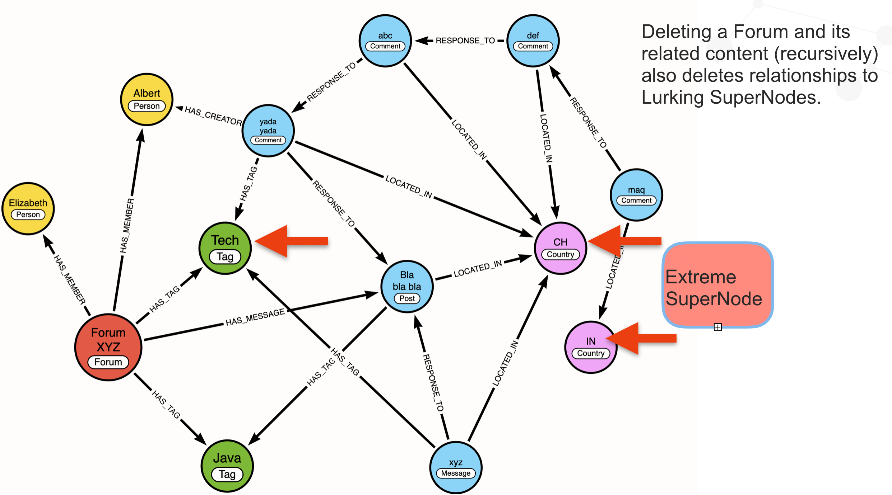

# Standard LDBC Queries


## Query i_short_1

### Description
For a given :Person.id, find the person and return some properties

### Status
tested successfully on SF1

### Results
``` text
Started streaming 1 records after 1 ms and completed after 1 ms.
```
### Optimized Cypher

``` text
// set the parameter
:params
{
  "personId": 24189255814529
}

MATCH (n:Person {id:$personId})-[:LOCATED_IN]->(p)
      RETURN
        n.firstName AS firstName,
        n.lastName AS lastName,
        n.birthday AS birthday,
        n.locationIP AS locationIP,
        n.browserUsed AS browserUsed,
        p.id AS cityId,
        n.gender AS gender,
        n.creationDate AS creationDate
```

## i_short_2
10 most recent posts and replies to those posts - and to those replies - up to 3 levels down

### Description
For a given :Person.id, find the person and their 10 most recent posts.  Find all replies to those posts and replies to those replies - up to 3 levels deep

### Status
tested successfully on SF1

### Results
``` text
Started streaming 10 records after 23 ms and completed after 26 ms.
```

### Optimized Cypher

``` Cypher
:params
{
  "personId": 24189255814529
}

// i_short_2

MATCH (:Person {id:$personId})<-[:HAS_CREATOR]->(message:Post)
      WITH
       message,
       message.id AS messageId,
       message.creationDate AS messageCreationDate
      ORDER BY messageCreationDate DESC, messageId ASC
      LIMIT 10
      // get replies to those posts
      MATCH (message)<-[:REPLY_OF*0..]-(reply),
            (reply)-[:HAS_CREATOR]->(person)

      RETURN
       messageId,
       messageCreationDate,
       coalesce(message.imageFile,message.content) AS messageContent,
       reply.id AS replyId,
       person.id AS personId,
       person.firstName AS personFirstName,
       person.lastName AS personLastName
      ORDER BY messageCreationDate DESC, messageId ASC

```


## i_short_3
10 Most Recent Friends


### Description
For a given :Person.id, find the person and the 10 :Persons with the most recent :KNOWS relationships.

### Status
tested successfully on SF1

### Results
``` text
Started streaming 7 records after 1 ms and completed after 3 ms.
```

### Optimized Cypher

``` Cypher
:params
{
  "personId": 24189255814529
}
// i_short_3
// 10 most recent friends
MATCH (n:Person {id:$personId})-[r:KNOWS]-(friend)
      RETURN
        friend.id AS personId,
        friend.firstName AS firstName,
        friend.lastName AS lastName,
        r.creationDate AS friendshipCreationDate
      ORDER BY friendshipCreationDate DESC, personId ASC

```


## i_short_4
Get Message by Id

### Description
For a given :Message.id, find the message and return some properties.

### Status
tested successfully on SF1
### Results
``` text
Started streaming 1 records in less than 1 ms and completed after 517 ms.
```
### Optimized Cypher

``` Cypher

// IS4. Content of a message
/*
:param messageId: 206158431836
 */
MATCH (m:Message {id:  $messageId })
RETURN
    m.creationDate as messageCreationDate,
    coalesce(m.content, m.imageFile) as messageContent
```
## i_short_5
Get Message by Id

### Description
For a given :Message.id, retrieve the name of the creator.
### Status
tested successfully on SF1
### Results
```text
Started streaming 1 records in less than 1 ms and completed after 478 ms.
```
### Optimized Cypher
``` Cypher
/*
:param messageId: 206158431836
 */

 // note:  this forces the parameter to be treated as a long integer instead of as a float.

WITH toInteger($messageId) as msgId
MATCH (m:Message {id:msgId})-[:HAS_CREATOR]->(p)
        RETURN
          p.id AS personId,
          p.firstName AS firstName,
          p.lastName AS lastName
```

## i_short_6
Get the name of the :Forum and :Moderator for the parent :Post given the id of a comment.

### Description
For a given :Comment.id, traverse a recursive relationship find the parent :Post.  Then retrieve the name of the :Forum the :Post belongs to and the name of the moderator.  

### Status
tested successfully on SF1

### Results
``` text
Started streaming 1 records after 1 ms and completed after 8 ms.
```

### Optimized Cypher
``` Cypher

/*
:param messageId: 206158431836
 */

 // note:  this forces the parameter to be treated as a long integer instead of as a float.

 WITH toInteger($messageId) as msgId
 MATCH (m:Comment {id:msgId})-[:REPLY_OF*0..]->(p:Post)<-[:CONTAINS]-(f)-[:HAS_MODERATOR]->(mod)
       RETURN
         f.id AS forumId,
         f.title AS forumTitle,
         mod.id AS moderatorId,
         mod.firstName AS moderatorFirstName,
         mod.lastName AS moderatorLastName
         LIMIT 1
```


## i_short_7
Get the name of persons that reply to a comment - and indicate if the original author knows each person making a response.

### Description
For a given :Message.id (either a :Post or :Comment) get the names of all persons replying to that message and deterimine if the person knows the author.

### Status
tested successfully on SF1

### Results
``` text
Started streaming 3 records after 1 ms and completed after 505 ms.
```
### Optimized Cypher
``` Cypher
/*
:param messageId: 824633721393
 */

 // note:  this forces the parameter to be treated as a long integer instead of as a float.

 WITH toInteger($messageId) as msgId
 MATCH (author)<-[:HAS_CREATOR]-(message:Message {id:msgId}),
        (message)<-[:REPLY_OF]-(reply),
        (reply)-[:HAS_CREATOR]->(replyAuthor)
        RETURN
         replyAuthor.id AS replyAuthorId,
         replyAuthor.firstName AS replyAuthorFirstName,
         replyAuthor.lastName AS replyAuthorLastName,
         reply.id AS commentId,
         reply.content AS commentContent,
         reply.creationDate AS commentCreationDate,
         exists((author)-[:KNOWS]-(replyAuthor)) AS replyAuthorKnowsOriginalMessageAuthor
        ORDER BY commentCreationDate DESC, replyAuthorId ASC
```
----

# Complex Queries

## Query i_complex_1
Find closest friends with same first name


### Description
A person may have many friends with the same first name. This query finds the 20 closest - in terms of number of hops - and then obtains some details for them.

### Status
tested successfully on SF1

### Results
``` Text
Started streaming 20 records after 1 ms and completed after 240 ms.
```

### Optimized Cypher

``` text
// set the parameters
:params
{
  "p1Id": 26388279067642,
  "firstName": "John"
}

MATCH (p:Person {id:$p1Id}), (friend:Person {firstName:$firstName})
       WITH p, friend
       MATCH path = shortestPath((p)-[:KNOWS*1..3]-(friend))
       WITH min(length(path)) AS distance, friend
       ORDER BY distance ASC, friend.lastName ASC, toInteger(friend.id) ASC
       LIMIT 20
       MATCH (friend)-[:LOCATED_IN]->(friendCity)
       OPTIONAL MATCH (friend)-[studyAt:STUDY_AT]->(uni)-[:LOCATED_IN]->(uniCity)
       WITH
         friend,
         collect(
           CASE uni.name
             WHEN null THEN null
             ELSE [uni.name, studyAt.classYear, uniCity.name]
           END
         ) AS unis,
         friendCity,
         distance
       OPTIONAL MATCH (friend)-[workAt:WORKS_AT]->(company)-[:LOCATED_IN]->(companyCountry)
       WITH
         friend,
         collect(
           CASE company.name
             WHEN null THEN null
             ELSE [company.name, workAt.workFrom, companyCountry.name]
           END
         ) AS companies,
         unis,
         friendCity,
         distance
       RETURN
         friend.id AS friendId,
         friend.lastName AS friendLastName,
         distance AS distanceFromPerson,
         friend.birthday AS friendBirthday,
         friend.creationDate AS friendCreationDate,
         friend.gender AS friendGender,
         friend.browserUsed AS friendBrowserUsed,
         friend.locationIP AS friendLocationIp,
         friend.email AS friendEmails,
         friend.speaks AS friendLanguages,
         friendCity.name AS friendCityName,
         unis AS friendUniversities,
         companies AS friendCompanies
       ORDER BY distanceFromPerson ASC, friendLastName ASC, friendId ASC
       LIMIT 20
```

## Query i_complex_2
Find closest friends with same first name

### Description
Get the 20 most recent messages from :Persons that know a given person where the messages are also before a given date

### Status
tested successfully on SF1

### Results
``` Text
Started streaming 20 records after 1 ms and completed after 226 ms.
```
### Optimized Cypher

``` text
// set the parameters
:params
{
  "personId": 26388279067642,
  "month":11,
  "day":30,
  "year":2012
}

WITH toInteger($personId) as pId, datetime({year: toInteger($year), month: toInteger($month), day: toInteger($day)}) AS maxDate

MATCH (:Person {id:pId})-[:KNOWS]-(friend)<-[:HAS_CREATOR]-(message)
       WHERE message.creationDate <= maxDate
       RETURN
         friend.id AS personId,
         friend.firstName AS personFirstName,
         friend.lastName AS personLastName,
         message.id AS messageId,
         COALESCE(message.content, message.imageFile) AS messageContent,
         message.creationDate AS messageCreationDate
       ORDER BY messageCreationDate DESC, messageId ASC
       LIMIT 20
```

## Query i_complex_3
Find closest friends with same first name


### Description

### Status
tested successfully on SF1

### Results
Started streaming 20 records after 1 ms and completed after 226 ms.

### Optimized Cypher

``` text
// set the parameters
:params
{
  "personId": 26388279067642,
  "month":11,
  "day":30,
  "year":2012
}

WITH toInteger($personId) as pId, datetime({year: toInteger($year), month: toInteger($month), day: toInteger($day)}) AS maxDate

MATCH (:Person {id:pId})-[:KNOWS]-(friend)<-[:HAS_CREATOR]-(message)
       WHERE message.creationDate <= maxDate
       RETURN
         friend.id AS personId,
         friend.firstName AS personFirstName,
         friend.lastName AS personLastName,
         message.id AS messageId,
         COALESCE(message.content, message.imageFile) AS messageContent,
         message.creationDate AS messageCreationDate
       ORDER BY messageCreationDate DESC, messageId ASC
       LIMIT 20
```


# Delete Queries

## Interactive-Delete-1

### Description
Find a person and delete them and the forums they moderate.  Delete posts and comments for those forums.

### Status
tested successfully on SF1

### Results
``` text
Deleted 535 nodes, deleted 2668 relationships, started streaming 1 records after 167 ms and completed after 311 ms.
```
### Original Cypher

From https://github.com/ldbc/ldbc_snb_interactive_impls/blob/main/cypher/queries/interactive-delete-1.cypher


``` text

// set the parameters
:params
{
  "personId": 26388279067642
}
WITH toInteger($personId) as personId

// DEL 1: Remove person and its personal forums and message (sub)threads
MATCH (person:Person {id: personId})
// DEL 6/7: Post/Comment
OPTIONAL MATCH (person)<-[:HAS_CREATOR]-(:Message)<-[:REPLY_OF*0..]-(message1:Message)
// DEL 4: Forum
OPTIONAL MATCH (person)<-[:HAS_MODERATOR]-(forum:Forum)
WHERE forum.title STARTS WITH 'Album '
   OR forum.title STARTS WITH 'Wall '
OPTIONAL MATCH (forum)-[:CONTAINER_OF]->(:Post)<-[:REPLY_OF*0..]-(message2:Message)
DETACH DELETE person, forum, message1, message2
RETURN count(*)
```


## Interactive-Delete-2
Delete a Like

### Description
Delete a Like for a Post by a Person

### Status
tested successfully on SF1

### Results
``` text
Deleted 1 relationship, started streaming 1 records in less than 1 ms and completed after 2 ms.
```
### Original Cypher

From https://github.com/ldbc/ldbc_snb_interactive_impls/blob/main/cypher/queries/interactive-delete-2.cypher


``` text

// DEL 2: Remove post like
MATCH (:Person {id: toInteger($personId)})-[likes:LIKES_POST]->(:Post {id: toInteger( $postId)})
DELETE likes
RETURN count(*)

```
### Optimized cypher
``` cypher
// set the parameters
:params
{
  "personId": 10995116280831,
  "postId":412316861426
}

// DEL 2: Remove post like
MATCH (:Person {id: toInteger($personId)})-[likes:LIKES_POST]->(:Post {id: toInteger( $postId)})
DELETE likes
RETURN count(*)
```

### Interactive-Delete-3
Delete a Like for a Comment

### Description
Similar to Delete-2 which delete a Like for a Post, this Cypher deletes a Like for a Comment.  

### Status
tested successfully on SF1

### Results
``` text
Deleted 1 relationship, started streaming 1 records in less than 1 ms and completed after 2 ms.
```
### Original Cypher

From https://github.com/ldbc/ldbc_snb_interactive_impls/blob/main/cypher/queries/interactive-delete-3.cypher


``` text

// DEL 3: Remove comment like
MATCH (:Person {id: $personId})-[likes:LIKES]->(:Comment {id: $commentId})
DELETE likes
RETURN count(*)

```
### Suggested Cypher
``` cypher
// set the parameters
:params
{
  "personId": 19791209302342,
  "commentId":1099511629097
}

// DEL 3: Remove Comment like
MATCH (:Person {id: toInteger($personId)})-[likes:LIKES_COMMENT]->(:Comment {id: toInteger( $commentId)})
DELETE likes
RETURN count(*)
```


## Interactive-Delete-4
Remove forum and its content

### Description
Remove a Forum and all of the comments to Posts in that Forum.

This is potentially huge operation for very popular forums with millions of comments.  That could easily result in OOM conditions.
If that becomes the situation, use the Call In Transaction batching technique along with a reasonable size for the number of records in a batch.  

The original query is somewhat odd because it finds the Forum and all of the Posts to that Forum and (recursively) finds all of the Comments to those Posts, but it only deletes the Forum and the Comments while leaving the Posts as potential orphans.

This query is also impacted by the poor data modeling decision to link Comments & Posts to Country nodes.  When a Comment is deleted with the DETACH option, its relationship to the Country will also be released.  Given that several of the Country nodes will be supernodes with millions/billions of relationships,  subjecting these nodes to millions of relationship deletes could cause significant locking issues.



This diagram helps to show the nodes and relationships that could be affected by this Cypher.  Most of the nodes and ALL of the relationships shown would have to be deleted.  Deleting relationships from supernodes such as the Country nodes could result in locking issues and OOM.  

### Status
tested successfully on SF1

### Results
``` text
Deleted 281 nodes, deleted 1027 relationships, started streaming 1 records after 46 ms and completed after 254 ms.
```
### Original Cypher

From https://github.com/ldbc/ldbc_snb_interactive_impls/blob/main/cypher/queries/interactive-delete-4.cypher

``` text
// DEL 4: Remove forum and its content
MATCH (forum:Forum {id: $forumId})
OPTIONAL MATCH (forum)-[:CONTAINER_OF]->(:Post)<-[:REPLY_OF*0..]-(message)
DETACH DELETE forum, message
RETURN count(*)

```
### Suggested Cypher
``` cypher
// set the parameters
:params
{
  "forumId": 687194767415l
}

MATCH (forum:Forum {id:toInteger($forumId)} )-[:CONTAINS]->(post:Post)<-[r:REPLY_OF*..]-(message)
// delete replying comments
CALL { WITH message
DETACH DELETE forum, post, message
} IN TRANSACTIONS OF 10000 ROWS

return count(*)

```
### Interactive-Delete-5
Remove a member from a forum

### Description
find a forum and a member then delete the relationship between them.  

### Status
tested successfully on SF1

### Results
``` text
Deleted 1 relationship, started streaming 1 records in less than 1 ms and completed after 15 ms.
```
### Original Cypher

From https://github.com/ldbc/ldbc_snb_interactive_impls/blob/main/cypher/queries/interactive-delete-5.cypher


``` text

// DEL 5: Remove forum membership
MATCH (:Forum {id: $forumId})-[hasMember:HAS_MEMBER]->(:Person {id: $personId})
DELETE hasMember
RETURN count(*)


```
### Suggested Cypher
``` cypher
// set the parameters
:params
{
  "forumId": 687194767361,
  "personId":30786325582874
}

// DEL 5: Remove forum membership
MATCH (:Person {id: toInteger($personId)})<-[hasMember:HAS_MEMBER]-(:Forum {id: toInteger( $forumId)})
DELETE hasMember
RETURN count(*)
```

## Interactive-Delete-6
Recursively delete all replies to a Post

### Description
find a Post and recursively delete all replies to it.  

This is very similar to Delete Query-4 except it starts with a single Post - not all of the posts in a Forum.

Because this query is an open-ended recursive query with potentially thousands or even millions of replies, it should be written to anticipate that.  The original Cypher from LDBC is sufficient for low volumes of messages, but an unexpectedly large volume would likely result in OOM.

### Status
tested successfully on SF1

### Results
``` text
Deleted 12 nodes, deleted 30 relationships, started streaming 1 records after 1 ms and completed after 5 ms.
```
### Original Cypher

From https://github.com/ldbc/ldbc_snb_interactive_impls/blob/main/cypher/queries/interactive-delete-6.cypher


``` text
// DEL 6: Remove post thread
MATCH (:Post {id: $postId})<-[:REPLY_OF*0..]-(message:Message) // DEL 6/7
DETACH DELETE message
RETURN count(*)


```
### Suggested Basic Cypher
``` cypher
// set the parameters
:params
{
  "postId": 343597384778
}

MATCH (:Post {id: toInteger($postId}))<-[:REPLY_OF*0..]-(message)  
DETACH DELETE message
RETURN count(*)

```

``
### Suggested Heavy-Duty Cypher
``` cypher
// set the parameters
:params
{
  "postId": 755914245410
}

MATCH (:Post {id: toInteger($postId}))<-[r:REPLY_OF*..]-(message)
// delete replying comments
CALL { WITH message
DETACH DELETE message
} IN TRANSACTIONS OF 10000 ROWS

return count(*)

```
### output from heavy-duty version
``` Text
Deleted 11 nodes, deleted 159 relationships, started streaming 1 records in less than 1 ms and completed after 51 ms.
```


## Interactive-Delete-7
Recursively delete all replies to a Comment

### Description
virtually identical to Delete-6 except   it starts with a Comment - not a Post

Because this query is an open-ended recursive query with potentially thousands or even millions of replies, it should be written to anticipate that.  The original Cypher from LDBC is sufficient for low volumes of messages, but an unexpectedly large volume would likely result in OOM.

### Status
tested successfully on SF1

### Results
``` text
Deleted 5 nodes, deleted 17 relationships, started streaming 1 records in less than 1 ms and completed after 2 ms.
```
### Original Cypher

From https://github.com/ldbc/ldbc_snb_interactive_impls/blob/main/cypher/queries/interactive-delete-7.cypher


``` text

// DEL 7: Remove comment subthread
MATCH (:Comment {id: $commentId})<-[:REPLY_OF*0..]-(comment:Comment)
DETACH DELETE comment
RETURN count(*)

```
### Suggested Basic Cypher
``` cypher
// set the parameters
:params
{
  "commentId": 962072675535
}

MATCH (:Comment {id: toInteger($commentId)})<-[:REPLY_OF*0..]-(message)  
DETACH DELETE message
RETURN count(*)

```

``
### Suggested Heavy-Duty Cypher
``` cypher
// set the parameters
:params
{
  "postId": 755914245410
}

MATCH (:Comment {id: toInteger($postId)})<-[r:REPLY_OF*..]-(message)
// delete replying comments
CALL { WITH message
DETACH DELETE message
} IN TRANSACTIONS OF 10000 ROWS

return count(*)

```
### output from heavy-duty version
``` Text
Deleted 8 nodes, deleted 25 relationships, started streaming 1 records after 1 ms and completed after 50 ms.
```

## Interactive-Delete-8
Remove a KNOWS relationship between 2 persons.

### Description
find 2 members and delete the [:KNOWS] relationship between them.  

### Status
tested successfully on SF1

### Results
``` text
Deleted 1 relationship, started streaming 1 records in less than 1 ms and completed after 15 ms.
```
### Original Cypher

From https://github.com/ldbc/ldbc_snb_interactive_impls/blob/main/cypher/queries/interactive-delete-8.cypher


``` text

// DEL 8: Remove friendship
MATCH (:Person {id: $person1Id})-[knows:KNOWS]-(:Person {id: $person2Id})
DELETE knows
RETURN count(*)


```
### Suggested Cypher
``` cypher
// set the parameters
:params
{
  "person1Id": 6597069767338,
  "person2Id":28587302324496
}


MATCH (:Person {id: toInteger($person1Id)})-[knows:KNOWS]-(:Person {id: toInteger( $person2Id)})
DELETE knows
RETURN count(*)
```
# Update Queries

## Interactive-Update-1
Insert a person

### Description
Create/Merge a Person node  and link them to several other (existing) nodes.

Pay careful attention to the parameters that provide relationship info.

The original CREATE commands were replaced with MERGE commands.  That may slow down the queries a tiny bit, but it's better from a data quality standpoint.

### Status
Test successfully using SF-1
### Results
``` text
Started streaming 1 records in less than 1 ms and completed after 17 ms.
```
### Original Cypher

From https://github.com/ldbc/ldbc_snb_interactive_impls/blob/main/cypher/queries/interactive-update-1.cypher


``` text

MATCH (c:City {id: $cityId})
CREATE (p:Person {
    id: $personId,
    firstName: $personFirstName,
    lastName: $personLastName,
    gender: $gender,
    birthday: $birthday,
    creationDate: $creationDate,
    locationIP: $locationIP,
    browserUsed: $browserUsed,
    languages: $languages,
    email: $emails
  })-[:IS_LOCATED_IN]->(c)
WITH p, count(*) AS dummy1
UNWIND $tagIds AS tagId
  MATCH (t:Tag {id: tagId})
  CREATE (p)-[:HAS_INTEREST]->(t)
WITH p, count(*) AS dummy2
UNWIND $studyAt AS s
  MATCH (u:Organisation {id: s[0]})
  CREATE (p)-[:STUDY_AT {classYear: s[1]}]->(u)
WITH p, count(*) AS dummy3
UNWIND $workAt AS w
  MATCH (comp:Organisation {id: w[0]})
  CREATE (p)-[:WORKS_AT {workFrom: w[1]}]->(comp)

  ```
  ### Parameters


``` cypher
params
{
  "cityId": 128,
  "tagIds":[17,18,17,20,21],
  "studyAt":[[1596,2021],[1595,2022]],
  "workAt":[[17,2021],[18,2022],[19,2022]],
  "person": {
    "id":12345,
    "firstName":"Eleanor",
    "lastName":"Roosevelt",
    "gender":"F",
    "birthday":"1809-02-12",
    "creationDate":"2022-07-04",
    "locationIP":"127.0.0.1"
  }
}
```

### Suggested Cypher

``` cypher

MATCH (c:City {id: toInteger($cityId)})
MERGE (p:Person {id:toInteger($person.id)})
ON CREATE SET p += {
    firsName:$person.firstName,
    lastName:$person.lastName
}
MERGE (p)-[:LOCATED_IN]->(c)
WITH p
UNWIND $tagIds AS tagId
  MATCH (t:Tag {id: tagId})
  MERGE (p)-[:HAS_INTEREST]->(t)

WITH DISTINCT p

UNWIND $studyAt AS s
  MATCH (u:University {id: toInteger(s[0])})
  MERGE (p)-[:STUDY_AT {classYear: s[1]}]->(u)

WITH DISTINCT p

UNWIND $workAt AS w
  MATCH (u:Organization {id: toInteger(w[0])})
  MERGE (p)-[:WORK_AT {classYear: w[1]}]->(u)

Return count (p) as personsAdded
```


## Interactive-Update-2
Insert a new LIKES Post relationship for a Person

### Description
Create/Merge a new LIKES_POST relationship for an existing person and an existing Post.

The original CREATE commands were replaced with MERGE commands.  That may slow down the queries a tiny bit, but it's better from a data quality standpoint.

### Status
Test successfully using SF-1
### Results
``` text
Started streaming 1 records in less than 1 ms and completed after 17 ms.
```
### Original Cypher

From https://github.com/ldbc/ldbc_snb_interactive_impls/blob/main/cypher/queries/interactive-update-2.cypher


``` text


MATCH (person:Person {id: $personId}), (post:Post {id: $postId})
CREATE (person)-[:LIKES {creationDate: $creationDate}]->(post)
  ```
  ### Parameters


``` cypher
:params
{
  "personId": 128,
  "postId":755914244157,
  "creationDate":"2022-05-07"
}
```

### Suggested Cypher

``` cypher

MATCH (post:Post {id: toInteger($postId)})
MATCH (person:Person {id:toInteger($person.id)})

MERGE (person)-[:LIKES_POST]->(post)
WITH p
UNWIND $tagIds AS tagId
  MATCH (t:Tag {id: tagId})
  MERGE (p)-[:HAS_INTEREST]->(t)

WITH DISTINCT p

UNWIND $studyAt AS s
  MATCH (u:University {id: toInteger(s[0])})
  MERGE (p)-[:STUDY_AT {classYear: s[1]}]->(u)

WITH DISTINCT p

UNWIND $workAt AS w
  MATCH (u:Organization {id: toInteger(w[0])})
  MERGE (p)-[:WORK_AT {classYear: w[1]}]->(u)

Return count (p) as personsAdded
```
-----------------

# Additional Queries
These are some useful queries that were used to demonstrate some features to an internal team.  They are NOT part of the LDBC package.

## extra query - Multi-hop to find replies to replies of a Post.

Find the replies to a Post, and all of the replies to those replies - up to 5 levels deep.  Returns the paths of all the replies.

``` text
:param messageId => 824634421209

match p=(post:Post {id: $messageId })<-[:REPLY_TO_POST]-(:Comment)<-[:REPLY_TO_COMMENT*0..5]-(:Comment)
return p
```

## Counting Tags for LIKES for timeframe

10 most popular LIKES for comments during a particular timeframe.

``` Cypher
// 10 most popular tags for a given date range
profile MATCH ()-[r:LIKES]->(m:Message)
WHERE datetime({year: 2012, month: 11, day:01}) <= r.creationDate <= datetime({year: 2012, month: 11, day:30})
with c
match (c)-[:HAS_TAG]->(t)
with t.name as tag, count(t) as count
return tag, count order by count desc limit 10
```


## Trending Tags
Find the Tags for all LIKES for comments during a particular timeframe.

``` Cypher

// Trending Tags -10 most popular tags from the last 1000 LIKES
profile MATCH ()-[r:LIKES]->(m:Message)
where exists(r.creationDate)
with m order by r.creationDate  desc limit 1000
match (m)-[:HAS_TAG]->(t)
with (t.name) as tagName, count (m) as count
return tagName, count order by count desc limit 10

```
